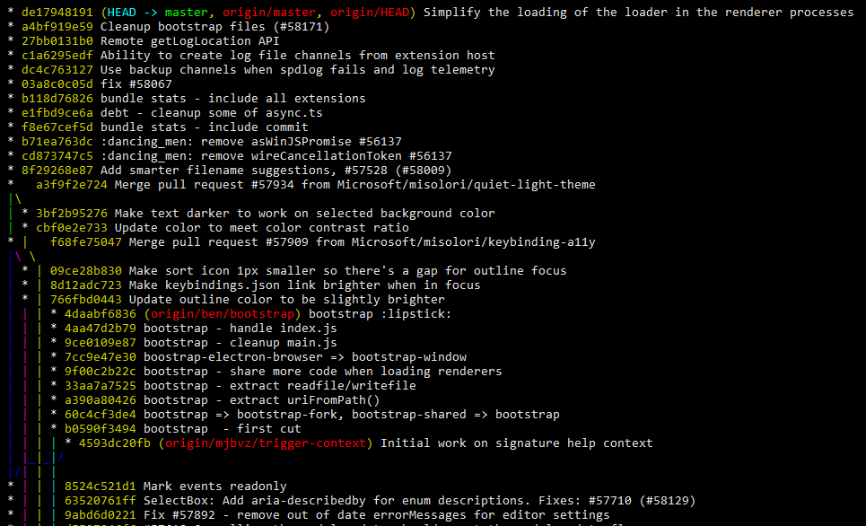

<!-- $theme: gaia -->

Advanced
===

# 

###### Created by Guy Van den Nieuwenhof<br/>[https://github.com/guyvdn](https://github.com/guyvdn)

---

# Agenda

- Properly configure Git
- Advanced Git commands 
- Customize Git with Git Hooks
- Further Reading

---

# Agenda

<!-- *template: invert -->

- **Properly configure Git**
- Advanced Git commands 
- Customize Git with Git Hooks
- Further Reading

---

# Properly configure Git

1. Files
2. Your Identity
3. Git Credential Manager
4. Editors
5. Checking Your Settings

---

<!-- footer: Properly configure Git -->

## Files

1. **/etc/gitconfig**
<small>System-wide configuration file. 
Pass the option **--system** to git config.</small>

2. **~/.gitconfig** or **~/.config/git/config**
<small>User-specific configuration file.
Pass the option **--global** to git config.</small>

3. **.git/config** (default)
<small>Repository specific configuration file.
Pass the option **--local** to git config.</small>

---

## Your Identity

**Global Identity**
```console
$ git config --global user.name "John Doe"
$ git config --global user.email johndoe@gmail.com
```

**Identity for customer specific repository**
```console
$ git config --local user.email johndoe@customer.com
```
---

## Git Credential Manager
  
<small>
  
Git Credential Managers simplify authentication with your Git repos. They also provide support two-factor authentication.
  
**Windows** 
Download and run the latest Git for Windows installer,
which includes the Git Credential Manager for Windows.
https://git-scm.com/download/win

**macOS and Linux**
```console
> git-credential-manager install
```
</small>

---
## Editors
<small>
  
**Text Editor**
```console
$ git config --global core.editor ✂
"'C:/Program Files (x86)/Notepad++/notepad++.exe' ✂
-multiInst -notabbar -nosession"
```
**Merge and Diff Tool**
```console
$ git config --global --add merge.tool kdiff3
$ git config --global --add mergetool.kdiff3.path "C:/../kdiff3.exe"
$ git config --global --add mergetool.kdiff3.trustExitCode false

$ git config --global --add diff.guitool kdiff3
$ git config --global --add difftool.kdiff3.path "C:/../kdiff3.exe"
$ git config --global --add difftool.kdiff3.trustExitCode false
```
</small>

---

## Checking Your Settings
<small>  
  
If you want to check your configuration settings, you can use the `git config --list` command to list all the settings Git can find at that point.

```console
$ git config --list
user.name=John Doe
user.email=johndoe@example.com
..
```
You may see keys more than once, because Git reads the same key from different files (`~/.gitconfig` and `.git/config`, for example). In this case, Git uses the last value for each unique key it sees.

</small>

---

## Checking Your Settings
<small>  
  
You can also check what Git thinks a specific key’s value is by typing `git config <key>`
```console
$ git config user.name
John Doe
```
  
</small>

---
<!-- footer: -->
<!-- *template: invert -->

# Agenda

- Properly configure Git
- **Advanced Git commands**
- Customize Git with Git Hooks
- Further Reading

---

# Advanced Git commands

1. git log
2. git reset
3. git rebase interactive
4. git worktree
5. git alias

---

<!-- footer: Advanced Git commands-->

## git log
<small><small>
  
Visualising the git history and branches is often an argument to use a git GUI tool but this can perfectly be done from the command line using `git log` with these commands:

<small>
  
**--all**
Shows all commits in the history of branches, tags and other refs

**--graph**
Text-based graphical representation of the commit history.

**--pretty**  
Pretty-print the contents of the commit logs.<br/>Can be oneline, short, medium, full, fuller, email, raw, format:\<string>

**--abbrev-commit**
Show partial prefix of the 40-byte hexadecimal commit object name.

**--oneline**
This is a shorthand for "--pretty=oneline --abbrev-commit" used together.

</small></small></small>

---

##  `$ git log --graph --all --oneline` 

# 

---
<small><small>
  
```console
$ git log --graph --all ✂
--pretty=format:"%C(auto)%d %s %C(yellow)%ad %C(cyan)<%an> %C(green)%h" ✂ 
--date="format-local:%Y-%m-%d %H:%M:%S"
```
</small></small>
  
# 

---

# git reset

### Can be used to undo changes that are ==local to your computer==

---

## git reset - trees

# 

---

## git reset - commands

git reset overwrites these trees in a specific order

<small>
  
**git reset --soft**
move the branch HEAD points to
==can be used to undo commits==

**git reset --mixed (default)**
also make the Index look like HEAD
==can be used to unstage changes==

**git reset --hard**
also make the Working Directory look HEAD
==can be used to undo changes==

</small>

---

## git reset - demo

---

# git rebase interactive

**git rebase --interactive**
**git rebase -i**

Make a list of the commits which are about to be rebased. Let the user edit that list before rebasing.

<small>
  
<br/><br/>
 
```text
Do not rebase commits that exist outside your repository.
If you follow that guideline, you’ll be fine. 
If you don’t, people will hate you.
```

</small>

---

## git-rebase-todo file

<small><small>
  
```text
pick 2a6ed8c v4
pick d5a5839 v5
pick 010a3f0 v6

# Rebase fba439a..010a3f0 onto fba439a (3 commands)
#
# p, pick <commit> = use commit
# r, reword <commit> = use commit, but edit the commit message
# e, edit <commit> = use commit, but stop for amending
# s, squash <commit> = use commit, but meld into previous commit
# f, fixup <commit> = like "squash", but discard this commit's log message
# x, exec <command> = run command (the rest of the line) using shell
# d, drop <commit> = remove commit
# l, label <label> = label current HEAD with a name
# t, reset <label> = reset HEAD to a label
# m, merge [-C <commit> | -c <commit>] <label> [# <oneline>]
# .       create a merge commit using the original merge commit's
# .       message (or the oneline, if no original merge commit was
# .       specified). Use -c <commit> to reword the commit message.
# These lines can be re-ordered; they are executed from top to bottom.
#
# If you remove a line here THAT COMMIT WILL BE LOST.
#
#	However, if you remove everything, the rebase will be aborted.
```

</small></small>

---

## git rebase interactive - commands

<small>
  
**pick**
use commit 
==default, use the commit as is==

**reword**
use commit, but edit the commit message
==do not change the message in the todo file, you will be prompted for a new message==

**edit**
use commit, but stop for amending
==can be used to add, remove or change files in the commit<br/>you will have to **git commit --amend** followed by **git rebase --continue** to complete this step==

</small>

---

## git rebase interactive - commands

<small>
  
**squash**  
use commit, but meld into previous commit
==can be used to combine multiple commits into one<br/>you will be prompted for which commit message to keep==

**fixup**
like "squash", but discard this commit's log message
==skip the prompt for the commit message if the first message is the one you would like to keep==
  
</small>

---

## git rebase interactive - commands

<small>
  
**drop**
remove commit
==e.g. remove merge commits that become irrelevant after rebasing==
  
**label**
label current HEAD with a name
==can be used to add a label in between commits==
 
</small>

---

## git alias
<small> 
  
Now that we have seen some advanced commands we can make it easier to use them wit `git alias`. 

For example, to correct the usability problem you encountered with unstaging a file you can add your own unstage alias to Git:

```console
$ git config --global alias.unstage 'reset HEAD --'
```
This makes the following two commands equivalent:

```console
$ git unstage fileA
$ git reset HEAD -- fileA
```
</small>

---

## git alias
<small> 
  
Some more commands

|Alias|Command|
|-:|:-|
|**s**        | status -sb
|**last**     | log -1 HEAD
|**tree**     | log --all --oneline --graph
|&nbsp;&nbsp;&nbsp;&nbsp;&nbsp;**branches** | branch -a
|**stashes**  | stash list
|**aliases**  | !git config -l \| grep alias \| cut -c 7- &nbsp;&nbsp;&nbsp;&nbsp;&nbsp;
|**echo**     | !echo \"$1\" && :
|**chs**	  | !git checkout && git s && :

</small>

---

## git alias

**Share aliases in team**

You can put all aliases inside a separate config file

```text
[alias]
  a = add
  ..
```

Add this file to your `.config` file as such

```text
[include]
    path = aliases.txt
```

---


# Agenda
<!-- footer: -->
<!-- *template: invert -->

- Properly configure Git
- Advanced Git commands 
- Customize Git with Git Hooks
- **Further Reading**


---
## Further Reading

<small><small>
  
**Git Reference Manual**<small>
  https://git-scm.com/docs
  The official and comprehensive man pages that are included in the Git package itself
</small>

**GitHub Cheat Sheet**<small>
  https://services.github.com/on-demand/downloads/github-git-cheat-sheet.pdf
  Summarizes commonly used Git command line instructions for quick reference
</small>

**Visual Git Cheat Sheet**<small>
  http://ndpsoftware.com/git-cheatsheet.html
  An interactive cheat sheet from NDP Software
</small>

**Pro Git book**<small>
  https://git-scm.com/book</br>Free book by **Scott Chacon** and **Ben Straub**. Also available on amazon.com
  </small>
  
</small></small>

